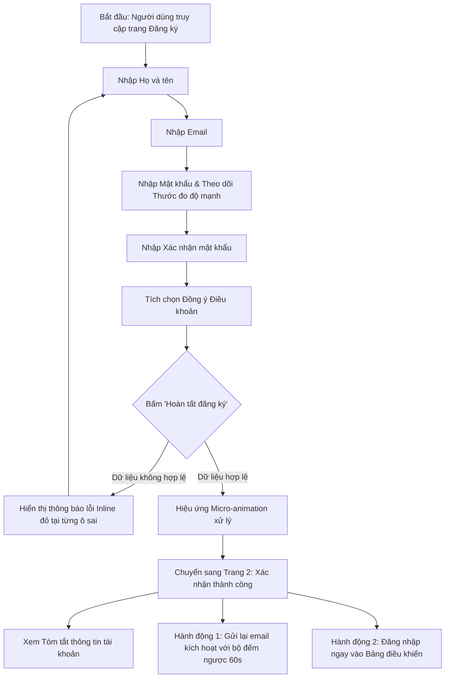

# BÁO CÁO THUYẾT MINH THIẾT KẾ UI/UX
## BÀI TẬP: THIẾT KẾ GIAO DIỆN TRANG ĐĂNG KÝ NGƯỜI DÙNG (CODEGYM)

---

- **Học viên thực hiện:** CodeGym Student  
- **Vị trí lưu trữ đồ án:** `F:\CodeGym`  
- **Công nghệ triển khai:** HTML5, CSS3 Tokens/Variables, Vanilla JavaScript ES6+, Responsive Multi-Platform  
- **Chế độ hỗ trợ:** High-Fidelity UI, Wireframe Blueprint Mode, UX Annotations Mode  

---

## PHẦN 1: NGHIÊN CỨU TRẢI NGHIỆM NGƯỜI DÙNG (UX RESEARCH)

### 1.1. Khảo sát & Phân tích các Mẫu Giao diện Đăng ký Tiêu biểu

| Tiêu chí so sánh | Google Sign-up | Facebook Register | Twitter / X Sign-up | Thiết kế CodeGym đã chọn |
|---|---|---|---|---|
| **Bố cục (Layout)** | 1 cột trung tâm tối giản, tập trung vào form chính | Modal nổi hoặc chia 2 cột (Marketing + Form) | Tối giản, nền tối/sáng, chia từng bước hoặc 1 trang ngắn | **1 Cột trung tâm (Card Center)** trên nền Ambient gradient mờ, tỷ lệ khung hình 490px lý tưởng |
| **Vị trí & Kích thước Nút bấm** | Nút "Tiếp theo" ở góc phải dưới, kích thước 40px | Nút "Đăng ký" xanh lá, full-width hoặc 50% width | Nút đen/trắng hình viên thuốc (Pill), bo tròn lớn | **Nút Primary CTA full-width, cao 52px**, đặt ngay dưới form theo luồng đọc Z-pattern/F-pattern |
| **Các trường bắt buộc** | Họ, Tên, Username/Email, Mật khẩu, Xác nhận MK | Họ, Tên, Số di động/Email, Mật khẩu mới, Ngày sinh, Giới tính | Tên, Email/SĐT, Ngày sinh | **4 trường bắt buộc cốt lõi:** Họ và tên, Email, Mật khẩu, Xác nhận mật khẩu |
| **Hướng dẫn điền thông tin (Helper Text)** | Ẩn/hiện khi focus vào ô input; báo lỗi chi tiết | Dấu chấm than đỏ kèm tooltip khi blur khỏi ô | Nhắc nhở số ký tự đếm ngược và yêu cầu định dạng | **Inline Helper Text & Checklist trực quan:** Tự động đổi màu và icon theo trạng thái người dùng gõ |

### 1.2. Rút ra Bài học Thiết kế Thân thiện với Người dùng
1. **Giảm thiểu ma sát (Frictionless Experience):** Không bắt người dùng khai báo thông tin không cần thiết ở giai đoạn đăng ký (như ngày sinh, số điện thoại, địa chỉ...).
2. **Ngăn chặn lỗi trước khi gửi (Error Prevention):** Kiểm tra format email và tính khớp mật khẩu theo thời gian thực (Real-time Inline Validation) thay vì bắt người dùng submit form rồi mới báo lỗi trang trắng.
3. **Phản hồi thị giác rõ ràng (Visual Affordance):** Con trỏ chuột, hiệu ứng hover, focus ring có độ tương phản cao đạt chuẩn WCAG 2.1 AA.

---

## PHẦN 2: BẢN PHÁC THẢO (WIREFRAME) VÀ LUỒNG NGƯỜI DÙNG (USER FLOW)

### 2.1. Sơ đồ Luồng Người dùng (User Flow Diagram)

### 2.2. Bản phác thảo Khung dây (Wireframe Mode)
Trong ứng dụng tại `F:\CodeGym\index.html`, bạn có thể bấm nút **"Wireframe"** trên thanh điều khiển trên cùng để xem trực tiếp phiên bản phác thảo đen trắng (Lo-Fi Blueprint) của toàn bộ 2 trang.

---

## PHẦN 3: CÁC NGUYÊN TẮC VÀ ĐỊNH LUẬT UI/UX ĐÃ ÁP DỤNG

### 3.1. Định luật Fitts (Fitts' Law)
- **Nội dung định luật:** Thời gian cần thiết để di chuyển nhanh tới một mục tiêu phụ thuộc vào tỷ lệ giữa khoảng cách đến mục tiêu và chiều rộng của mục tiêu ($T = a + b \log_2(2D / W)$).
- **Ứng dụng thực tế trong đồ án:**
  - Nút Submit chính (**"Hoàn tất đăng ký tài khoản"**) và nút **"Đăng nhập vào Hệ thống"** được thiết kế với chiều cao **52px** và chiều rộng **100% card (full-width)**.
  - Vùng chạm (touch target) vượt xa tiêu chuẩn tối thiểu của Apple/Google (48x48px), giúp người dùng cả trên PC (chuột) lẫn Mobile (ngón tay cái) đều bấm chính xác ngay lập tức mà không sợ bấm trượt.
  - Các ô input cũng có chiều cao chuẩn 48px với khoảng đệm ngón tay thoải mái.

### 3.2. Định luật Hick (Hick's Law)
- **Nội dung định luật:** Thời gian đưa ra quyết định tăng theo số lượng và mức độ phức tạp của các lựa chọn.
- **Ứng dụng thực tế:** Form chỉ giới hạn đúng **4 trường thông tin bắt buộc** theo đề bài, không đưa thêm các trường rườm rà.

### 3.3. Định luật Jakob (Jakob's Law)
- **Nội dung định luật:** Người dùng dành phần lớn thời gian trên các trang web khác, do đó họ mong muốn trang web của bạn hoạt động tương tự như những gì họ đã quen thuộc.
- **Ứng dụng thực tế:** 
  - Vị trí nút Đăng ký bằng Google và GitHub được đặt trên cùng.
  - Thứ tự các trường đi theo thói quen toàn cầu: Họ tên -> Email -> Mật khẩu -> Xác nhận mật khẩu -> Checkbox điều khoản -> Nút Submit.
  - Liên kết *"Đã có tài khoản? Đăng nhập ngay"* đặt ở chân form.

### 3.4. Nguyên tắc Gestalt & Phản hồi Thị giác (Feedback & Affordance)
- **Luật Gần nhau (Proximity):** Label nằm sát ô input tương ứng, helper text nằm ngay bên dưới input thuộc nhóm đó.
- **Thước đo độ mạnh mật khẩu (Password Strength Meter):** Phân 3 mức (Yếu - Đỏ, Trung bình - Cam, Mạnh - Xanh) kèm 4 checklist cụ thể: độ dài, chữ hoa, chữ số, ký tự đặc biệt.
- **Biểu tượng Ẩn/Hiện mật khẩu:** Cho phép kiểm tra lại mật khẩu đã gõ để hạn chế tối đa sai sót.

---

## PHẦN 4: THIẾT KẾ ĐÁP ỨNG (RESPONSIVE DESIGN)

- **Mobile (< 640px):** Form co giãn linh hoạt 100% bề ngang, padding thu gọn còn 20px, nút đăng ký full-width dễ bấm bằng ngón tay cái một tay (Thumb-zone), các lưới nút xã hội chuyển thành dạng xếp chồng hoặc 1 cột chuẩn.
- **Tablet (641px - 1024px):** Giữ tỷ lệ cân đối trung tâm màn hình, tương thích cảm ứng mượt mà.
- **Desktop (> 1024px):** Hiển thị thẻ Card nổi bật ở trung tâm với hiệu ứng chiều sâu Glassmorphism và Ambient Glow cao cấp.

---

## PHẦN 5: CẤU TRÚC CHI TIẾT 2 MÀN HÌNH THEO ĐỀ BÀI

### 5.1. Trang 1: Form Đăng ký Người dùng
- **Trường 1 (Họ và tên):** Yêu cầu nhập tối thiểu 2 từ, hỗ trợ ký tự tiếng Việt đầy đủ.
- **Trường 2 (Email):** Kiểm tra biểu thức chính quy (Regex) đạt chuẩn RFC 5322.
- **Trường 3 (Mật khẩu):** Có nút mắt ẩn/hiện, thanh màu đo độ mạnh, 4 tiêu chí bảo mật hiển thị trực tiếp.
- **Trường 4 (Xác nhận mật khẩu):** So sánh giá trị theo thời gian thực, có icon và thông báo trùng khớp hoặc không khớp.
- **Hộp kiểm (Checkbox):** Bắt buộc tích đồng ý điều khoản dịch vụ CodeGym.
- **Nút CTA (Fitts' Law):** Nút màu chàm (Indigo/Violet) gradient, hiệu ứng trượt mũi tên khi hover.

### 5.2. Trang 2: Xác nhận Đăng ký Thành công
- **Huy hiệu Thành công (Success Badge):** Vòng tròn xanh lá kèm dấu tích nổi bật với hiệu ứng viền phát sáng (Pulse animation).
- **Tiêu đề chúc mừng:** Thông báo đã kích hoạt gửi thư đến chính địa chỉ email mà người dùng vừa nhập tại Trang 1.
- **Thẻ Tóm tắt Thông tin (User Summary Box):**
  - Họ và tên người dùng.
  - Email tài khoản.
  - Ngày giờ đăng ký hệ thống.
  - Trạng thái tài khoản: *Chờ xác nhận email*.
- **Nút Hành động Chính:** Nút "Đăng nhập vào Hệ thống" lớn (Fitts' Law).
- **Nút Hành động Phụ:** Nút "Gửi lại email kích hoạt" có tích hợp bộ đếm ngược 60 giây chống spam.
- **Liên kết điều hướng:** Cho phép quay lại Trang 1 để sửa hoặc tạo tài khoản khác.

---

## PHẦN 6: HƯỚNG DẪN XEM VÀ NỘP BÀI TRÊN HỆ THỐNG CODEGYM

### 6.1. Xem bài thiết kế trực tiếp trên máy tính
1. Mở thư mục `F:\CodeGym`.
2. Nhấp đúp vào file `index.html` để mở bằng bất kỳ trình duyệt nào (Chrome, Edge, Firefox).
3. Thử nghiệm:
   - Gõ thông tin vào các ô để trải nghiệm Inline Validation và Thước đo mật khẩu.
   - Bấm nút **"Wireframe"** để xem bản phác thảo khung dây.
   - Bấm nút **"Ghi chú UX"** để xem các định luật UI/UX được đánh dấu trực quan trên từng thành phần.
   - Bấm nút hình mặt trời/mặt trăng để chuyển đổi Dark Mode và Light Mode.
   - Điền đầy đủ thông tin và bấm Submit để xem chuyển tiếp sang Trang 2.

### 6.2. Bộ ảnh chụp màn hình hoàn chỉnh đã chuẩn bị sẵn để nộp bài
Toàn bộ ảnh chụp màn hình chất lượng cao phục vụ nộp bài được lưu tại thư mục:  
👉 **`F:\CodeGym\screenshots\`**

1. `01_trang_dang_ky_hifi.png`: Giao diện Form đăng ký hoàn thiện (Trang 1).
2. `02_trang_xac_nhan_hifi.png`: Giao diện Xác nhận đăng ký thành công (Trang 2).
3. `03_wireframe_dang_ky.png`: Bản phác thảo khung dây Wireframe của Trang 1.
4. `04_ux_notes_annotation.png`: Chế độ hiển thị trực quan các ghi chú định luật UI/UX.
5. `05_responsive_mobile.png`: Giao diện hiển thị chuẩn responsive trên thiết bị di động.

> **Học viên chỉ cần tải các ảnh trong thư mục `F:\CodeGym\screenshots` lên cổng nộp bài của CodeGym kèm đường dẫn bài làm.**
